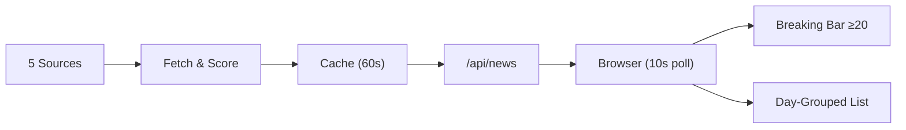

# Orbiter

I got tired of wading through listicles and deals to find the 3 tech stories that actually mattered. So I made this.

## Why

Pulls from HN, TechCrunch, Ars, The Verge, NYT Tech. Every story gets scored — company mentions, event keywords, AI model names. Each hit adds 10 points. Listicle/deal/review keywords auto-reject at -20. Nothing passes unless it scores ≥ 10. That's the filter. Hardcoded, no exceptions.

I wanted near-instant delivery when something breaks. So the frontend polls every 10 seconds. Server refreshes every 60. Day-grouped layout. Breaking stories (score ≥ 20) get their own row at the top with hover summaries. All hardcoded into a single HTML file — zero dependencies, ready to drop into a macOS widget.

## Pipeline



**Scoring:** Each story gets +10 per signal (company mention, event keyword, AI model match). Exclusion keywords (deals, reviews, tutorials) auto-reject. Score ≥ 10 passes, ≥ 20 hits the breaking hero bar.

```
~85 raw → [company +10] [event +10] [AI model +10] [exclusion -20] → score ≥ 10? → ~34 relevant
                                                                         ↓
                                                                   ≥ 20? → Breaking bar
                                                                   < 20? → Day-grouped list
```

- **5 sources** → ~85 raw → relevance filter → ~34 stories
- **10s frontend polling** — near-instant delivery
- **60s server cache refresh** — rate-limit friendly
- **Auto-categorization** into CS / AI / ML / Startups
- **Day-grouped layout** — "Today" / "Yesterday" / date headers
- **Breaking hero bar** — score ≥ 20 stories get dedicated cards with hover previews
- **Live indicator** — pulsing dot + timestamp so you know it's live

## Next

The entire frontend is one HTML file with everything inlined. I built it this way so I can drop it straight into Übersicht or a WidgetKit panel without touching anything else.

Same backend will power:
- A **terminal CLI** that prints your daily briefing
- A **menubar app** for breaking stories
- A **mobile widget**
- An **API** for other tools to consume

More sources, sharper filtering, better categorization. All hardcoded, all mine.

## Run it

```bash
git clone https://github.com/RehanMohammed985/Orbiter.git
cd Orbiter
npm install
node server.js
# → http://localhost:3000
```

## Stack

- Node.js / Express
- RSS + HN API scraping
- In-memory cache, 60s refresh
- Frontend: one HTML file, ~900 lines, all CSS/JS inlined, zero dependencies
