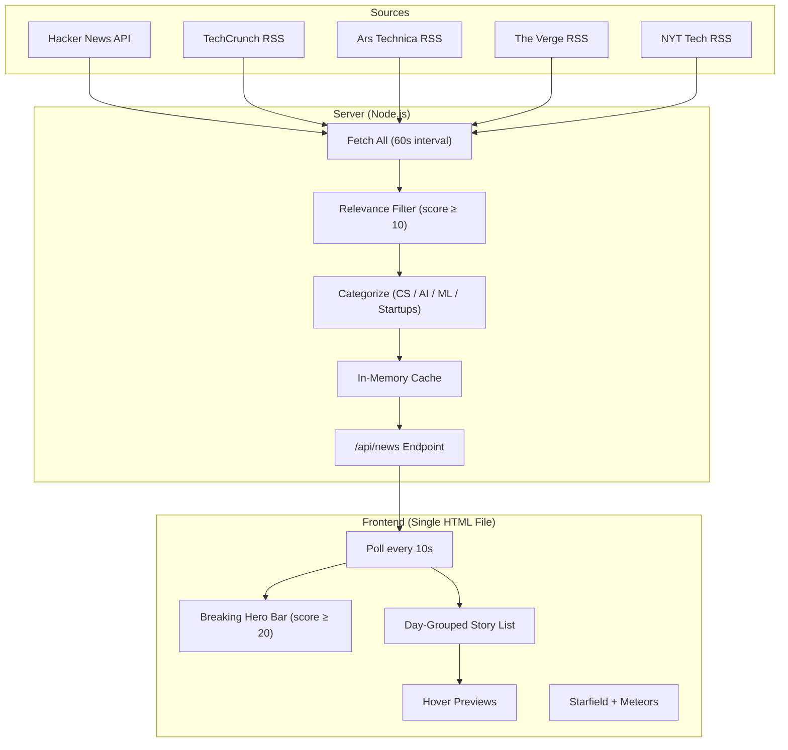
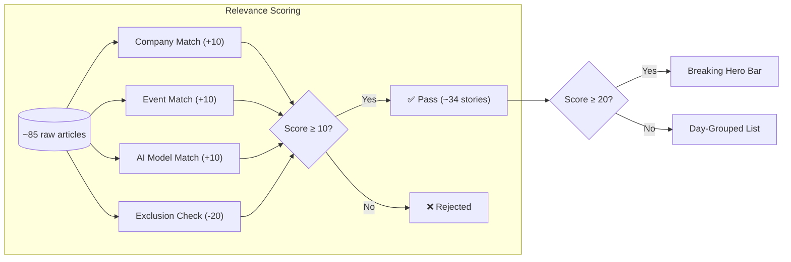
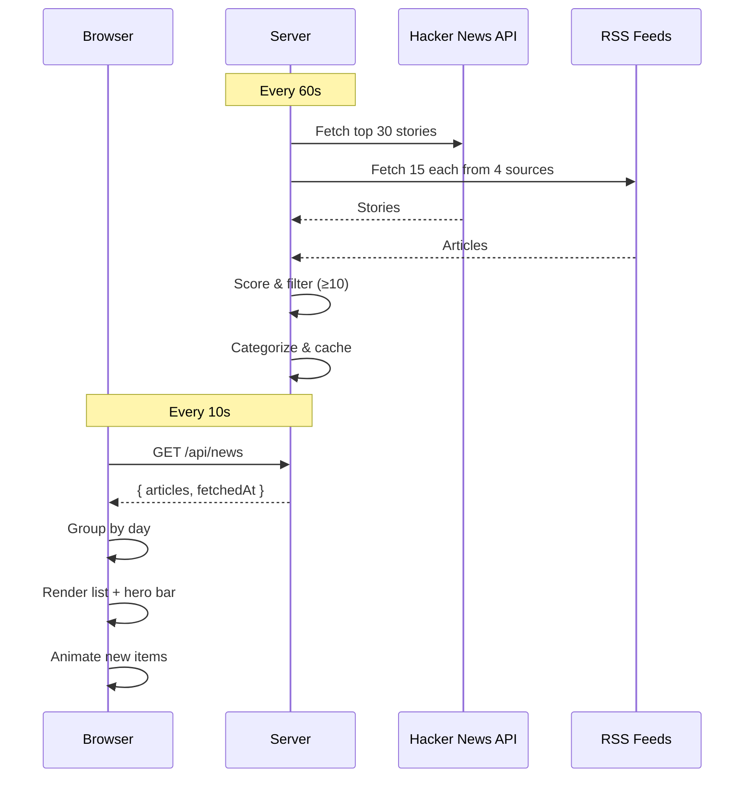

# Orbiter

A real-time, space-themed news dashboard for the engineering mind. Built to cut through the noise.

## Why Orbiter

I read a lot of news. Probably too much. The problem isn't finding news — it's that there's always too much. Deals, reviews, listicles, tutorials, puff pieces — they all compete for the same attention as the signal.

Orbiter is my answer to that. It pulls from a handful of high-signal outlets (Hacker News, TechCrunch, Ars Technica, The Verge, NYT Tech), runs every story through a relevance filter, and only surfaces what actually matters for someone building things in tech. No fluff. No clickbait. No noise.

The space theme isn't decorative — it's the point. The black void, the drifting meteors, the gold clock glowing in the dark — this is what it feels like to sit at a terminal at 2 AM, chasing a bug or a breakthrough. The interface should feel alive because the news cycle is.

## How it works







- **5 sources** → ~85 raw articles → relevance filter → ~34 stories that pass
- **10-second frontend polling** — near-instant delivery when something breaks
- **60-second server cache refresh** — balanced against API rate limits
- **Relevance scoring** (companies × events × AI models) — stories that hit multiple signals score higher
- **Automatic categorization** into CS / AI / ML / Startups
- **Day-grouped layout** — "Today", "Yesterday", date headers with gold accents
- **Breaking news hero bar** — the biggest stories (score ≥ 20) get a dedicated horizontal card row with hover previews
- **Jarvis-style hover previews** — hover any breaking card for a clean, glass-morphism summary
- **Live status indicator** — pulsing green dot with gold timestamp so you know the feed is alive
- **Shooting stars** — long-tailed meteors drifting across pure black space

## What's next

Orbiter is designed from the ground up to become a **macOS widget**. The frontend is a single self-contained HTML file with all CSS and JS inlined — ready to drop straight into Übersicht or a native SwiftUI WidgetKit panel.

But that's just the start. The same architecture — relevance-scored, categorized, real-time — can power:
- A **terminal CLI** that prints your daily briefing
- A **menubar app** that surfaces breaking stories
- A **mobile widget** for quick scans
- An **API** that other tools can consume

More sources are coming. Better filtering. Smarter categorization. The goal is the same: give you the news that matters, as fast as possible, in a space that feels worth staring at.

## Getting started

```bash
# Install
git clone https://github.com/RehanMohammed985/Orbiter.git
cd Orbiter
npm install

# Run
node server.js
# → http://localhost:3000
```

The dashboard auto-refreshes every 10 seconds. Open it in a browser, or embed the `public/widget.html` file directly into a widget runner.

## Tech

- Node.js / Express backend
- RSS + Hacker News API scraping
- In-memory cache with 60s refresh
- Zero-dependency frontend (single HTML file, ~900 lines, all CSS/JS inline)
