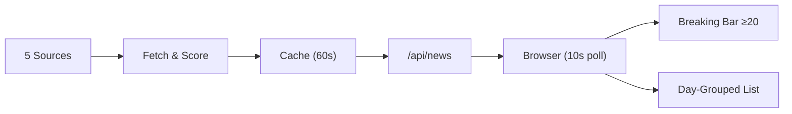

# Orbiter

A real-time news dashboard for the engineering mind. Built to cut through the noise.

## Why Orbiter

I read a lot of news. Probably too much. The problem isn't finding news — it's that there's always too much. Deals, reviews, listicles, tutorials, puff pieces — they all compete for the same attention as the signal.

Orbiter is my answer to that. It pulls from a handful of high-signal outlets (Hacker News, TechCrunch, Ars Technica, The Verge, NYT Tech), runs every story through a relevance filter, and only surfaces what actually matters for someone building things in tech. No fluff. No clickbait. No noise.

## Pipeline



**Scoring:** Each story gets +10 per signal (company mention, event keyword, AI model match). Exclusion keywords (deals, reviews, tutorials) auto-reject. Score ≥ 10 passes, ≥ 20 hits the breaking hero bar.

```
~85 raw → [company +10] [event +10] [AI model +10] [exclusion -20] → score ≥ 10? → ~34 relevant
                                                                         ↓
                                                                   ≥ 20? → Breaking bar
                                                                   < 20? → Day-grouped list
```

- **5 sources** → ~85 raw → relevance filter → ~34 stories
- **10s frontend polling** — near-instant delivery
- **60s server cache refresh** — rate-limit friendly
- **Auto-categorization** into CS / AI / ML / Startups
- **Day-grouped layout** — "Today" / "Yesterday" / date headers
- **Breaking hero bar** — score ≥ 20 stories get dedicated cards with hover previews
- **Live indicator** — pulsing dot + timestamp so you know it's live

## What's next

Built as a single self-contained HTML file (all CSS/JS inline) — ready to drop into Übersicht or a native SwiftUI WidgetKit panel.

Same architecture can power:
- A **terminal CLI** for daily briefings
- A **menubar app** for breaking stories
- A **mobile widget**
- An **API** for other tools

More sources, better filtering, smarter categorization coming. The goal: give you the news that matters, as fast as possible.

## Getting started

```bash
git clone https://github.com/RehanMohammed985/Orbiter.git
cd Orbiter
npm install
node server.js
# → http://localhost:3000
```

## Tech

- Node.js / Express backend
- RSS + Hacker News API scraping
- In-memory cache with 60s refresh
- Zero-dependency frontend (single HTML file, all CSS/JS inline)
